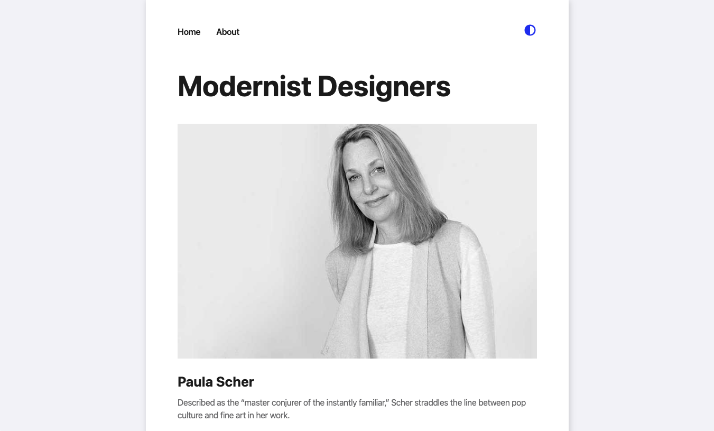

# Gatsby-Theme-Mdx Tutorial

_This repository is the source code for my tutorial on how to build a Gatsby Theme with MDX and Theme UI. It exists as a reference file for the final code produced. You can find links for the live site and for the tutorial below._

#### Helpful Links

-   [Gatsby-Theme-MDX Tutorial Article](https://www.dropbox.com/scl/fi/lkojk0wmciw9lcjfhmnn1/Build-a-Gatsby-Theme-with-MDX-and-Theme-UI.paper?dl=0&rlkey=xc2lf0w8vc0t7xa4svn40q7m8)
-   [View the Live Site](https://confident-lamport-d5be78.netlify.com/)
-   [Build a Gatsby Theme Article](https://www.gatsbyjs.org/tutorial/building-a-theme/e)
-   [Theme UI Docs](https://theme-ui.com/)



#### Who This Is For:

_If you have built a few sites with Gatsby, and understand their basic paradigms, this tutorial is a great opportunity to learn more about themes and building scalable UI with Theme-UI. I should note that this tutorial by no means covers all of the technical complexity around themes, but I do believe it will expose you to several new routes for discovery within Themes._

## Getting Started

#### Clone This Repo and Run Locally

After you clone this repository, open the project in your code editor. Make sure you are in the root directory, and run:
<br/>
<br/>
`yarn install`
<br/>
<br/>
next run:
<br/>
<br/>
`yarn workspace site develop`
<br/>
<br/>
This will automatically open the site on your localhost.
You can use this repo as a reference guide to view the code and results you are aiming towards.

#### Open the Tutorial Article and Begin Building

Now, head on over to the [Tutorial Article](https://www.dropbox.com/scl/fi/lkojk0wmciw9lcjfhmnn1/Build-a-Gatsby-Theme-with-MDX-and-Theme-UI.paper?dl=0&rlkey=xc2lf0w8vc0t7xa4svn40q7m8) to get started. Good luck, and I hope you learn a lot in the process!

#### Share with Me

If you have any thoughts or would like to show me what you build please hit me up on [Twitter](https://twitter.com/JeremyStuBarnes)

## Customize the Content

If you would like to, you can add any posts and even update the the name of the site in this repo. This allows you to create your very own blog from it.

#### Change the Title, Description, or Social Links:

You can change the title of the site by opening the `site/gatsby-config.js` file in your code editor and adjusting the following code:

```
	siteMetadata: {
		title: "<YourTitle>",
		author: "<YourAuthor>",
		description: "<YourDescription>",
		twitter: "<YourTwitterLink>",
		github: "<YourGithubProfileLink>"
	}
```

#### Add a New Post:

You can add a new post to the site as well. Open up the `site/src/data` folder. Duplicate one of `.mdx` the files, and name it anything you like. Now you can update any of the fields you want, and any of the content below.

```
title: <YourTitle>
slug: <YourPostURL>
description: <YourDescription>
coverImage: "./images/<YourImageName>.jpg"
```

Alternatively, you can also delete any of the posts, by just removing them from the folder.

#### Add an Image:

To add an image for your post, open `site/src/data/images` and drag a new image in there. You can now use that image in one of your Posts `coverImage` field.

#### Update the About Page

You can add also update the about page information. Open up `site/src/data/sitePages`. You can update any of the fields and / or customize any of the content below.

**_Thanks for using!_**
